# 📊 Table Manager

Веб-приложение для управления табличными данными. Создавайте, редактируйте, фильтруйте и ищите записи в множестве таблиц — всё в одном интерфейсе.

## ✨ Возможности

- **Множественные таблицы** — переключение между таблицами через вкладки или боковую панель
- **CRUD операции** — создание, чтение, редактирование, удаление записей
- **Поиск** — глобальный поиск по всем таблицам и поиск внутри таблицы
- **Фильтрация** — фильтрация записей по любому столбцу
- **Виртуальный скролл** — производительная работа с большими таблицами
- **Экспорт / Импорт** — выгрузка и загрузка данных
- **Поиск дубликатов** — обнаружение повторяющихся записей
- **Управление колонками** — настройка видимости и порядка столбцов
- **Настраиваемый layout** — сворачиваемая боковая панель, компактный и полный виды
- **Тёмная тема** — переключение светлой / тёмной темы

## 📸 Скриншоты

| # | Скриншот | Описание |
|---|----------|----------|
| 1 | [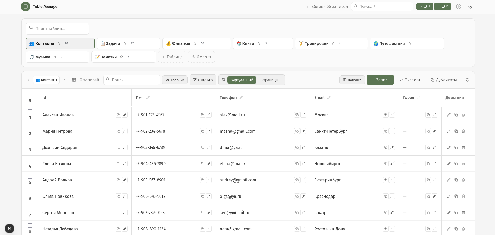](screenshots/01-main-view.png) | **Главный вид** — вкладки таблиц + таблица «Контакты» с inline-редактированием |
| 2 | [](screenshots/02-main-view-fullscreen.png) | **Главный вид** — полный вид с панелью инструментов |
| 3 | [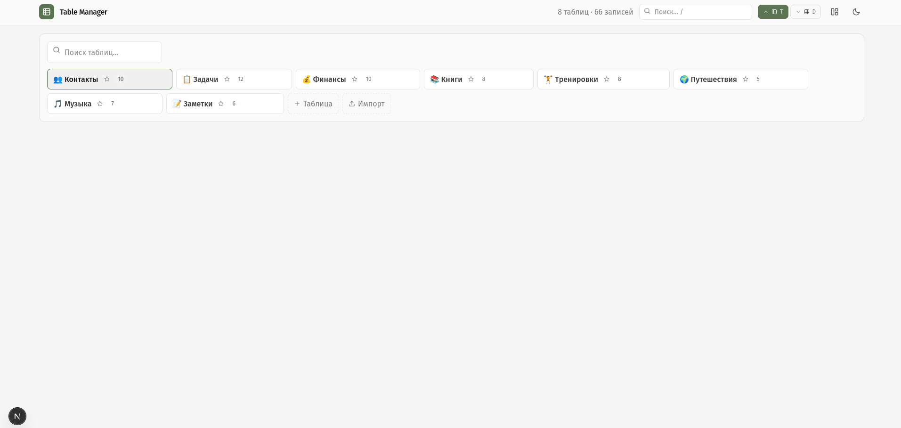](screenshots/03-tabs-only.png) | **Вкладки таблиц** — компактный вид только с навигацией по таблицам |
| 4 | [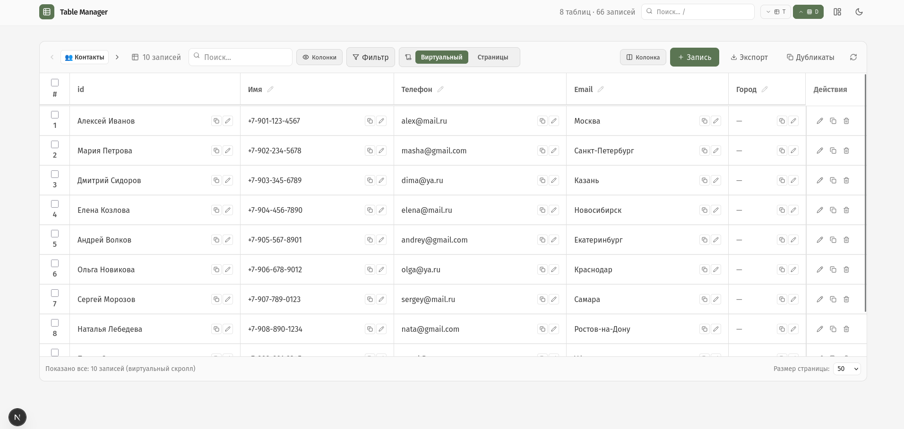](screenshots/04-table-full-height.png) | **Таблица на полную высоту** — развёрнутый вид без боковой панели |
| 5 | [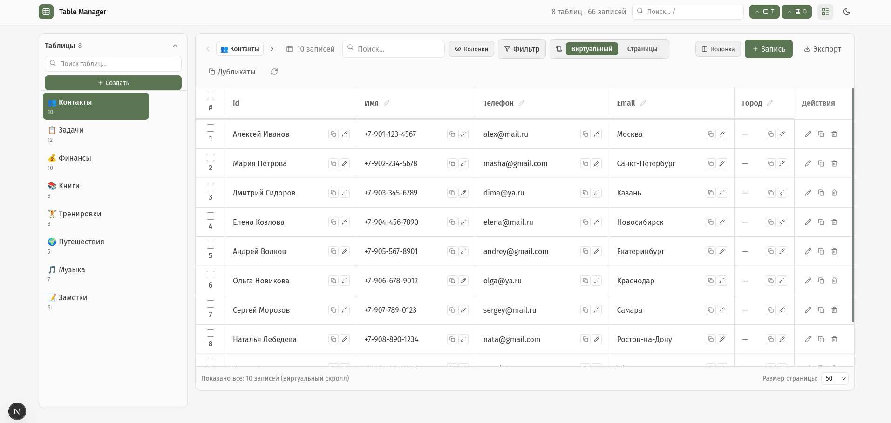](screenshots/05-sidebar-expanded.png) | **Развёрнутая боковая панель** — список всех 8 таблиц слева |
| 6 | [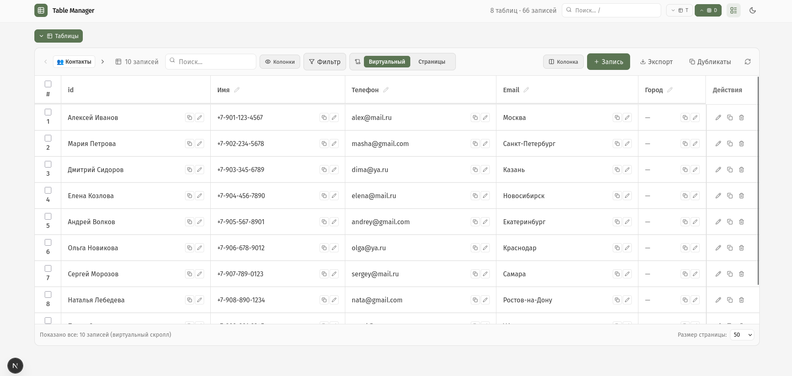](screenshots/06-sidebar-collapsed.png) | **Свёрнутая боковая панель** — минималистичный вид |
| 7 | [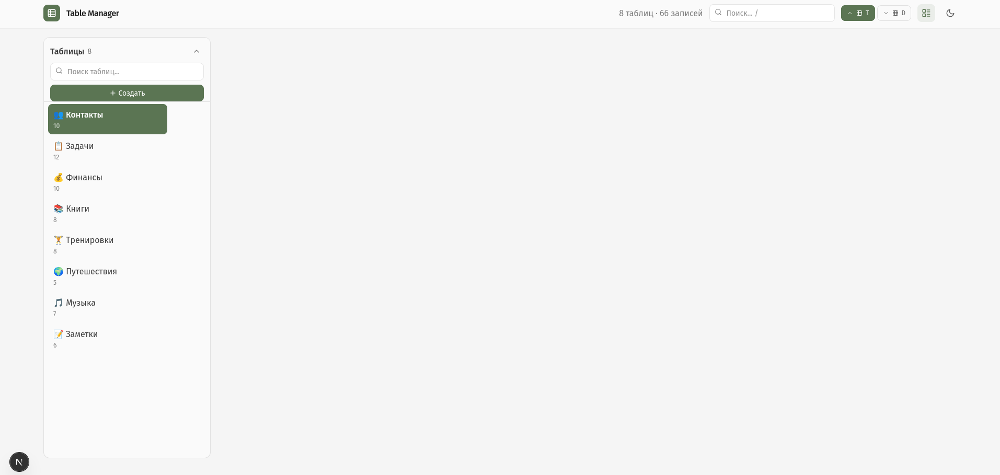](screenshots/07-sidebar-only.png) | **Только боковая панель** — вид с скрытой таблицей |
| 8 | [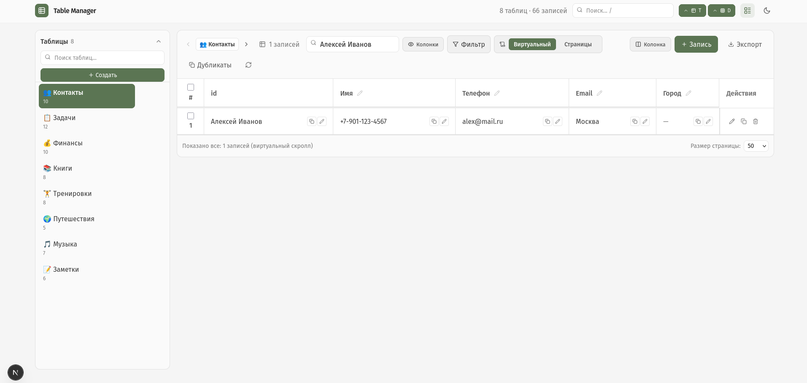](screenshots/08-search-result.png) | **Результат поиска** — фильтрация таблицы по имени «Алексей Иванов» |
| 9 | [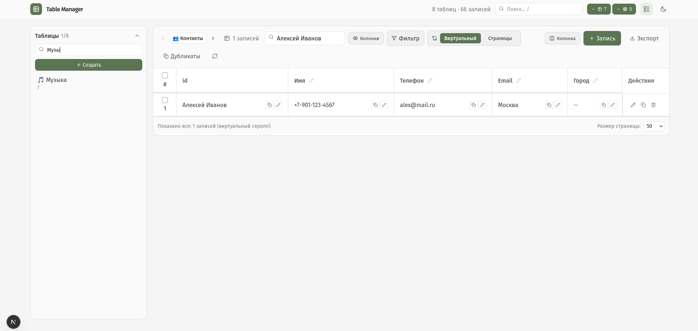](screenshots/09-sidebar-search.png) | **Поиск в боковой панели** — мгновенный фильтр таблиц по названию |
| 10 | [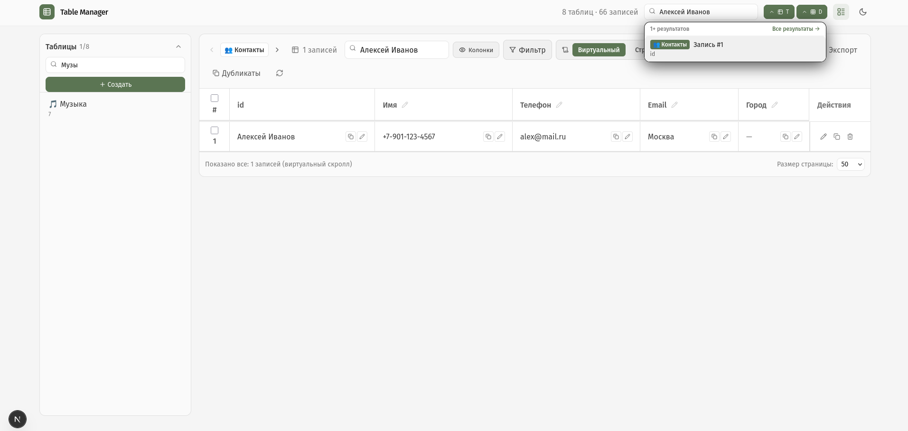](screenshots/10-global-search-dropdown.png) | **Глобальный поиск** — dropdown с результатами по всем таблицам |
| 11 | [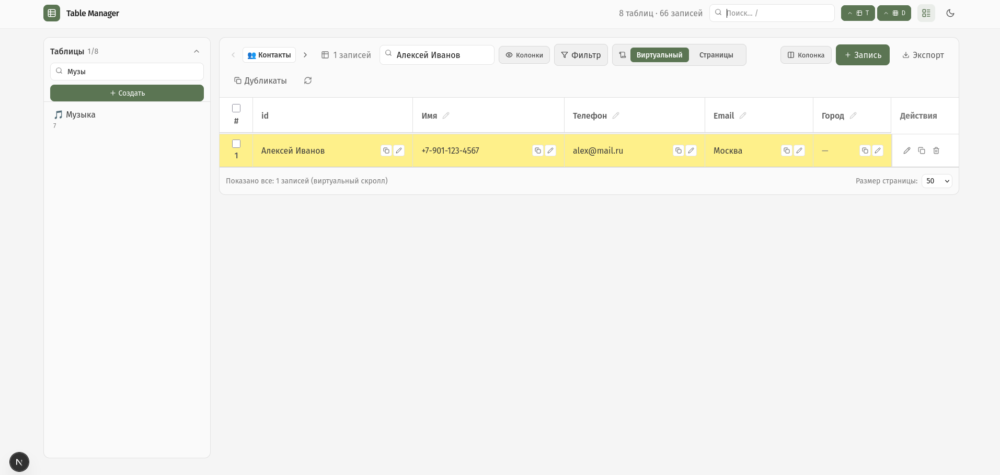](screenshots/11-highlighted-row.png) | **Подсветка найденной строки** — выделение результата поиска жёлтым |
| 12 | [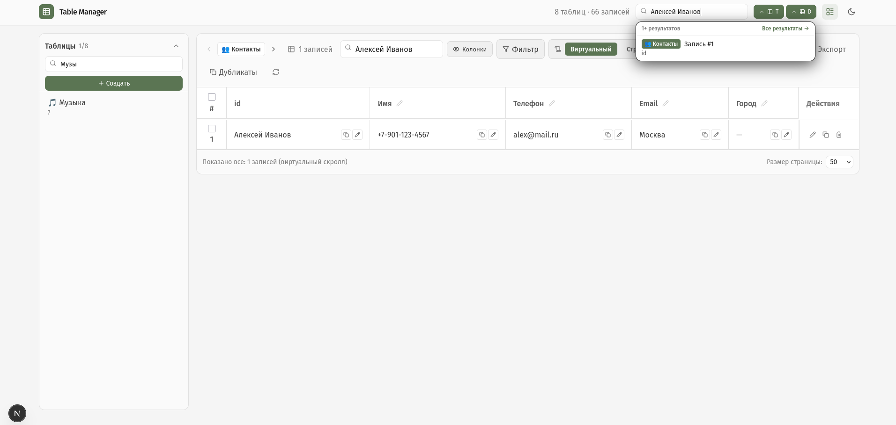](screenshots/12-search-dropdown-full.png) | **Dropdown глобального поиска** — результаты с навигацией к записи |
| 13 | [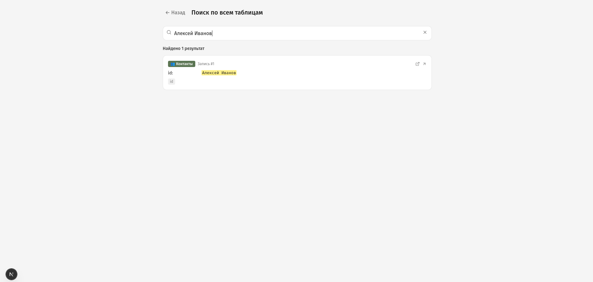](screenshots/13-global-search-page.png) | **Страница глобального поиска** — полноценный поиск по всем таблицам |

## 🚀 Быстрый старт

```bash
git clone https://github.com/<your-username>/table-manager.git
cd table-manager
npm install
npm run dev
```

Откройте [http://localhost:3000](http://localhost:3000)

## 🛠 Стек

- **Next.js** / **React** — фреймворк
- **TypeScript** — типизация
- **TanStack Table** — виртуальный скролл, сортировка, фильтрация
- **shadcn/ui** + **Tailwind CSS** — компоненты и стили

## 📦 Демо-данные

Приложение поставляется с 8 предустановленными таблицами:

| Таблица | Записей |
|---------|---------|
| 👥 Контакты | 10 |
| 📋 Задачи | 12 |
| 💰 Финансы | 10 |
| 📚 Книги | 8 |
| 🏋️ Тренировки | 8 |
| 🌍 Путешествия | 5 |
| 🎵 Музыка | 7 |
| 📝 Заметки | 6 |

## 📝 Лицензия

MIT
