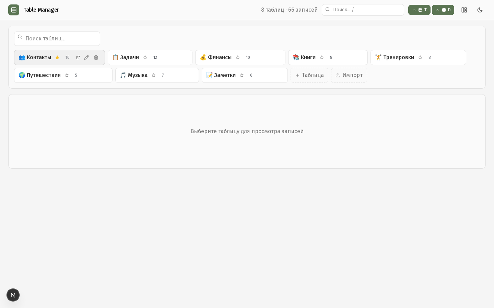
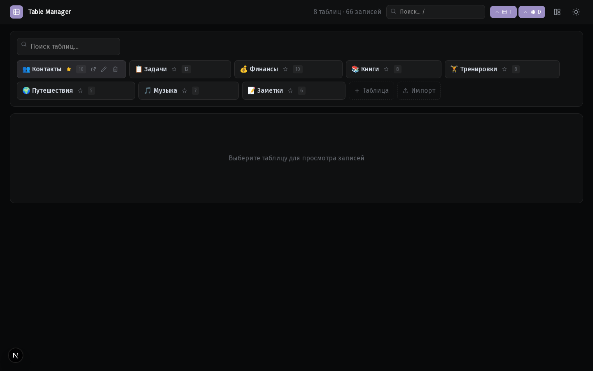
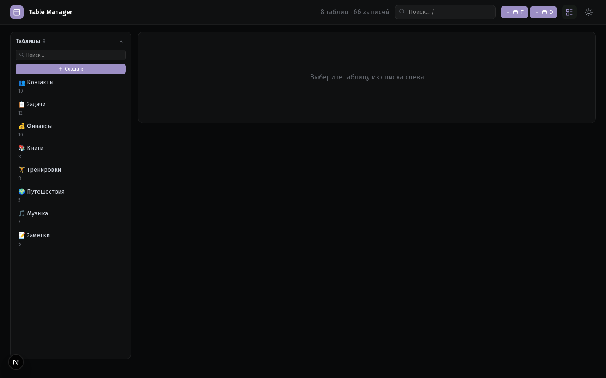
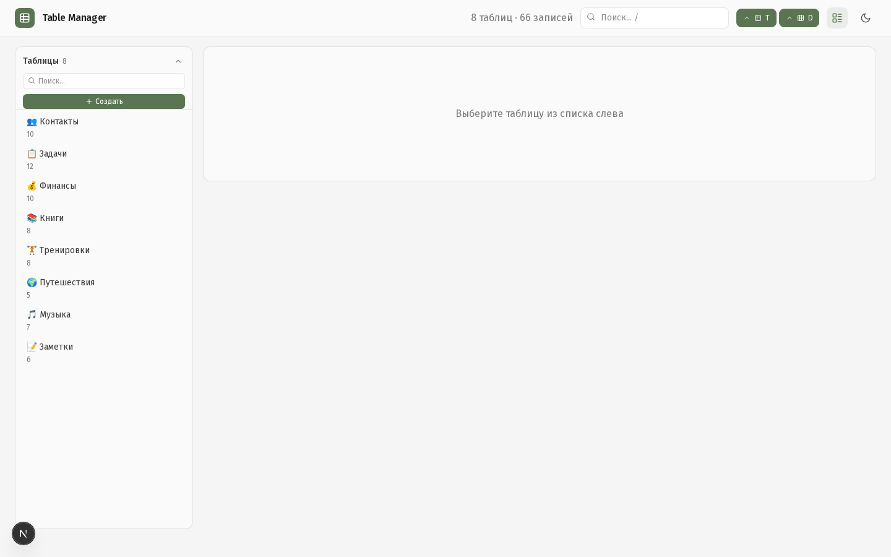
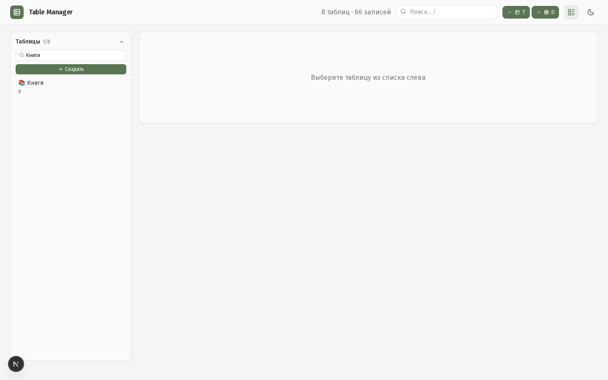
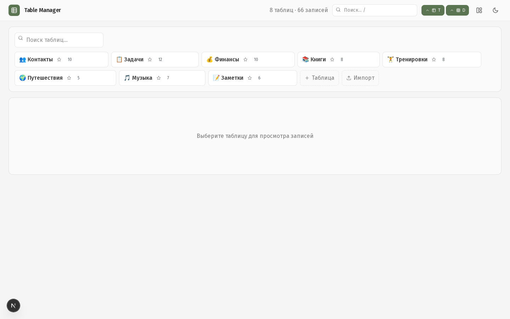
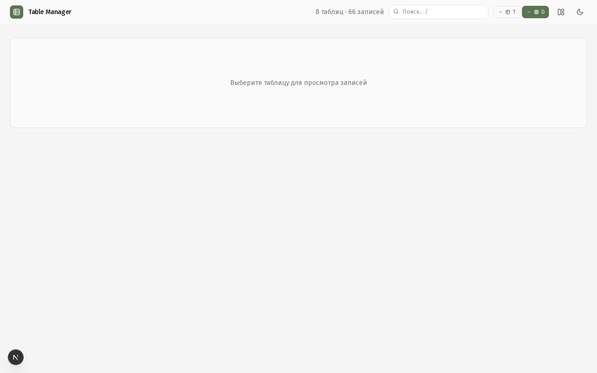

# Table Manager

Приватный дашборд для управления таблицами — локальный Airtable без внешней базы данных. Хранит всё в JSON-файле на вашем сервере.



## Возможности

### Управление данными
- **CRUD таблиц** — создание, переименование, удаление
- **Inline-редактирование** — двойной клик по ячейке
- **Виртуализация** — `@tanstack/react-virtual` для больших таблиц (>100 строк)
- **Пагинация** — 25 / 50 / 100 / 200 записей на страницу
- **Мульти-сортировка** — по нескольким колонкам
- **Фильтры** — по колонкам с пресетами (localStorage)

### Поиск и навигация
- **Глобальный поиск** — по всем таблицам с подсветкой совпадений
- **Command Palette** — `Ctrl+K` для быстрого доступа к командам
- **Keyboard shortcuts** — `T` (таблицы), `D` (данные), `←/→` (навигация)

### Импорт / Экспорт
- **CSV / JSON** — drag-and-drop импорт с превью
- **Режимы импорта** — новая таблица или добавление в существующую
- **Экспорт** — CSV и JSON

### Дополнительно
- **Дубликаты** — поиск повторяющихся значений по колонке
- **Копирование записей** — single и batch
- **Bulk операции** — batch copy/delete через единый API
- **Контекстное меню** — правый клик на записях
- **Shift+Click** — выделение диапазона
- **Избранное** — таблицы в избранном (localStorage)
- **Layout modes** — таблицы сверху или боковая панель
- **Тёмная / светлая тема** — переключение, сохраняется
- **Оптимистичные обновления** — UI до ответа сервера, rollback при ошибке

## Скриншоты

### Основной вид

*Светлая тема, режим «таблицы сверху»*


*Тёмная тема*

### Боковая панель

*Режим «боковая панель»*


*Тёмная тема, боковая панель*

### Поиск в сайдбаре

*Фильтрация таблиц по названию*

### Таблица

*Навигация по записям*


*Поиск и фильтрация внутри таблицы*

### Inline-редактирование

*Двойной клик для редактирования ячейки*

### Command Palette

*`Ctrl+K` — быстрый доступ к командам*

### Свёрнутые секции

*Скрытие панелей таблиц и данных*

## Установка

### Требования
- Node.js >= 20
- npm

### Быстрый старт

```bash
# Клонировать репозиторий
git clone https://github.com/<your-username>/table-manager.git
cd table-manager

# Установить зависимости
npm install

# Скопировать .env.example
cp .env.example .env

# Запустить dev-сервер
npm run dev
```

Откройте [http://localhost:49721](http://localhost:49721)

### Демо-данные

Для заполнения 8 демо-таблицами (77 записей):

```bash
node scripts/seed-demo.js
```

## Production

### Билд и запуск

```bash
npm run build
npm start
```

### systemd

```bash
# Отредактировать пути в table-manager.service
sudo cp table-manager.service /etc/systemd/system/
sudo systemctl daemon-reload
sudo systemctl enable table-manager
sudo systemctl start table-manager
```

## Структура проекта

```
table-manager/
├── src/
│   ├── app/                  # Next.js App Router
│   │   ├── api/              # REST API (таблицы, записи, колонки, поиск, экспорт)
│   │   ├── search/           # Страница глобального поиска
│   │   ├── layout.tsx
│   │   └── page.tsx
│   ├── components/
│   │   ├── DataTable.tsx     # Основная таблица с виртуализацией
│   │   ├── TableCards.tsx    # Карточки таблиц + импорт
│   │   ├── CommandPalette.tsx
│   │   └── Toast.tsx
│   ├── lib/
│   │   └── store.ts          # Файловое хранилище (JSON + mutex)
│   └── types/
│       └── index.ts          # TypeScript интерфейсы
├── data/
│   └── store.json            # БД (игнорируется в git)
├── scripts/
│   ├── dev.sh                # Dev-сервер + открытие браузера
│   ├── seed-demo.js          # Генерация демо-данных
│   ├── take-screenshots.js   # Скриншоты через Playwright
│   └── audit-gitignore.sh    # Аудит секретов
├── screenshots/              # Скриншоты для README
├── public/                   # Статические файлы
├── table-manager.service     # systemd юнит
└── .env.example
```

## Технологии

| | |
|---|---|
| **Фреймворк** | Next.js 15 (App Router) |
| **Язык** | TypeScript (strict) |
| **UI** | React 19 |
| **Стили** | Tailwind CSS v4 + CSS variables |
| **Виртуализация** | @tanstack/react-virtual |
| **Модалки** | Radix UI |
| **Иконки** | Lucide React |
| **Шрифты** | Fira Sans (Cyrillic + Latin), Fira Code |

## Лицензия

MIT
